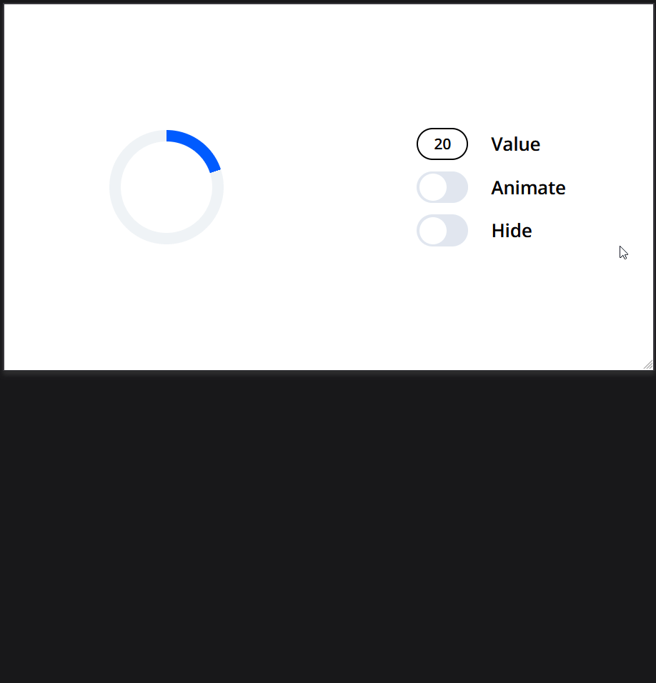

# Блок Progress

## Параметры

`size` - размер блока.
Примеры: size="20px", size="2rem"

`ring-width` - ширина кольца, расширяется к центру блока.
Примеры: ring-width="4px", ring-width="0.5rem"

`ring-color` - цвет кольца.
Примеры: ring-color="gray"

`progress-color` - цвет прогресса кольца.
Примеры: progress-color="blue"

`background-color` - цвет центральной части блока.
Примеры: background-color="black"

`period` - период вращения прогресса кольца.
Примеры: period="1s"

`value` - прогресс, значение от 0 до 100.
Примеры: value="0", value="54"

`animated` - включает вращение кольца прогресса.

`hidden` - скрывает блок.

